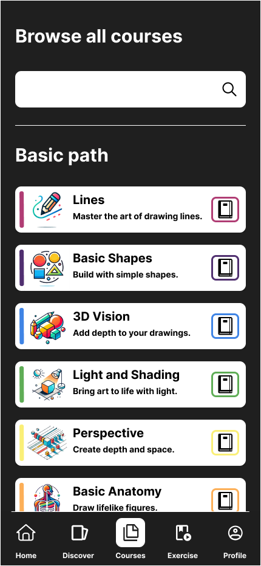
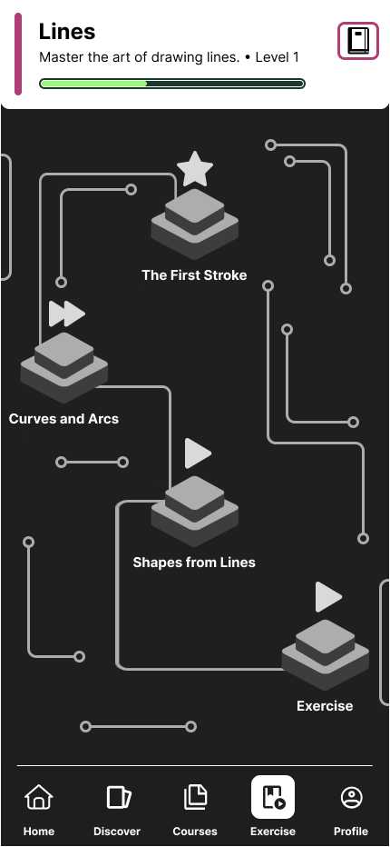
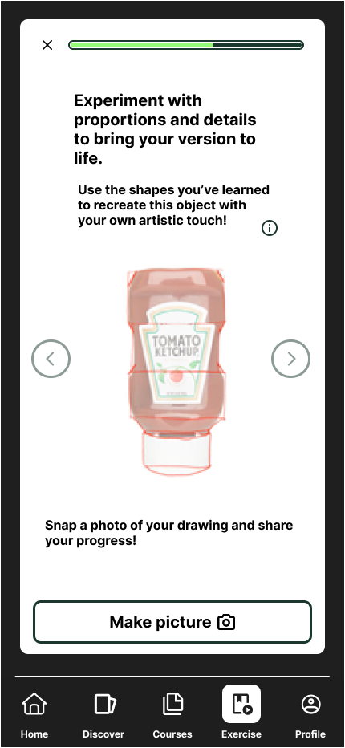

# ArtQuest

ArtQuest is an innovative application designed to inspire and develop users' artistic skills through engaging exercises, challenges, and AI-driven feedback. The platform allows users to practice their creativity, compare their artwork with curated examples, and track their progress.

## Table of Contents

- [ArtQuest](#artquest)
  - [Table of Contents](#table-of-contents)
  - [Features](#features)
  - [Screenshots](#screenshots)
  - [Tech Stack](#tech-stack)
    - [Frontend](#frontend)
    - [Additional Tools](#additional-tools)
  - [Setup](#setup)

## Features

- **Interactive Exercises**: Practice drawing, sketching, and painting with guided exercises.
- **AI Feedback**: Submit your artwork and receive AI-powered feedback to improve your skills.
- **Challenges**: Participate in creative challenges and compare your results with curated examples.
- **User Authentication**: Sign up using email, Google, or GitHub.
- **Custom Artwork Upload**: Upload your own images to track progress or receive feedback.
- **Personalized Progress Tracking**: Visualize your improvement over time with progress metrics.
- **API Integration**: Backend support for user management, artwork submissions, and feedback processing.

## Screenshots






## Tech Stack

### Frontend
- **React Native**: Cross-platform mobile application development.
- **Clerk**: User authentication and session management.

### Additional Tools
- **AI Models**: Used for generating feedback and visual analysis.

## Setup

1. Clone the repository:
   ```bash
   git clone https://github.com/xTaromarux/ArtQuest.git
   cd ArtQuest
   ```

2. Install dependencies:
   ```bash
   npm install
   ```

3. Start the development servers:
    Frontend:
    ```bash
    npx expo start
    ```

